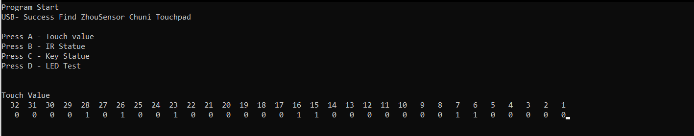

# HID Reports

Using yuan_chuni_lowlight.exe HID mode

    Pads locations:
                                        [LEDs]
    [30] [28] [26] [24] [22] [20] [18] [16] [14] [12] [10] [8] [6] [4] [2] [0]
    [31] [29] [27] [25] [23] [21] [19] [17] [15] [13] [11] [9] [7] [5] [3] [1]
                                    [Wrist Rest]

```
vid = 0x1973
pid = 0x2001
```

    IN:
        35 bytes
    
        1st byte: ReportID 0x00
    
        2nd byte is Air sensors
            When no air sensor pcb is connected, it stays at 0x3F (0b00111111), all signal pins are at 3.3V (which is detected as HIGH)    
    
        3rd byte is face buttons
            Pressing nothing:         0b00000000
            Pressing Right button:    0b00000001
            Pressing Middle button:   0b00000010
            Pressing Left button:     0b00000100
    
        4th byte to 35th bytes are sensor pads pressure data in reverse
            from 0x00 to 0xFF (255)
            4th byte is Pad 31    (Bottom Left)
            5th byte is Pad 30    (Top Left)
            ...
            34th byte is Pad 1    (Bottom Right)
            35th byte is Pad 0    (Top Right)
    



```
OUT:
    63 bytes
    1st byte: ReportID 0x00

    Rest are for controlling LEDs
    2 bytes control 1 LED
    First LED is at the rightmost of the board (Above Pad 31)
    Bitmask: gggg grrr (second byte) | rrrb bbbb (first byte)
```

---

# Microcontrollers details

Main MCU on the main PCB is a STM32F103C8T6, firmware is ZIOS, Zhousensor's propriety firmware.
Said to have write protect, all content will be wiped if tampered, if you wanna trust his word.

Pinout is in [this](zhou_chuni_stm32.png) picture provided by ZhouSensor.

[Touch chips](../pcb_pics/main_board/7.jpg) (4 of them) have their markings lasered off. (SOP20?)

- [Here](zhou_chuni_touchchip.png)'s the communication protocol provided by ZhouSensor.

[Air tower's MCU](../pcb_pics/air_board/air_right_3.jpg) also has its markings lasered off, but its safe to assume its just works as an ADC.
I have written a [test sketch](/zhou_air_test) for arduino to emulate interfacing with the main MCU.
