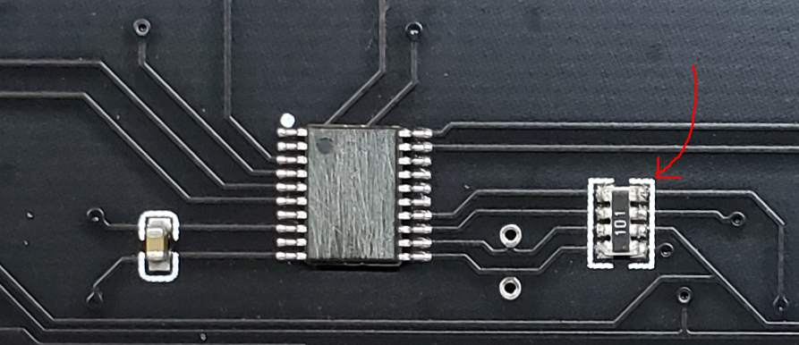

# A section of the board is not responding!

This is most likely caused by the solder joints of the resistor array disconnected from the PCB due to the crazy amount of board flex on this awefully long board without any solid support from behind.

#### To troubleshoot:

1. Turn the board upside down

2. Connect it to your PC with the tester program open

3. you should see which section of the touch pads aren't working

4. Press down (Apply pressure) onto the resistor array and see if it works again
   
   

5. If yes, congrats, just reflow that particular resistor array with a soldering iron (remember to use flux) and you're good to go!
   
   ---

# OMG Red Light of Death on my controller!!!!!1111!!11!!

Apparently the fix is the same as above.

---

# Ground slider LED triggering air sensors

According to Yuan this happens due to power draw issues. Confirmed to happen when all slider LEDs are on all white at full brightness by myself. (Good job whoever designed this PCB)

**The solution (slidershim):** try turning down the brightness.

**The solution (chuniio):** shouldn't happen under normal circumstances, try another USB port (preferably USB 3), and/or flash the lowlight firmware to see if it helps.

---

# Air sensors spamming keystrokes

Try putting the controller away from sunlight.
